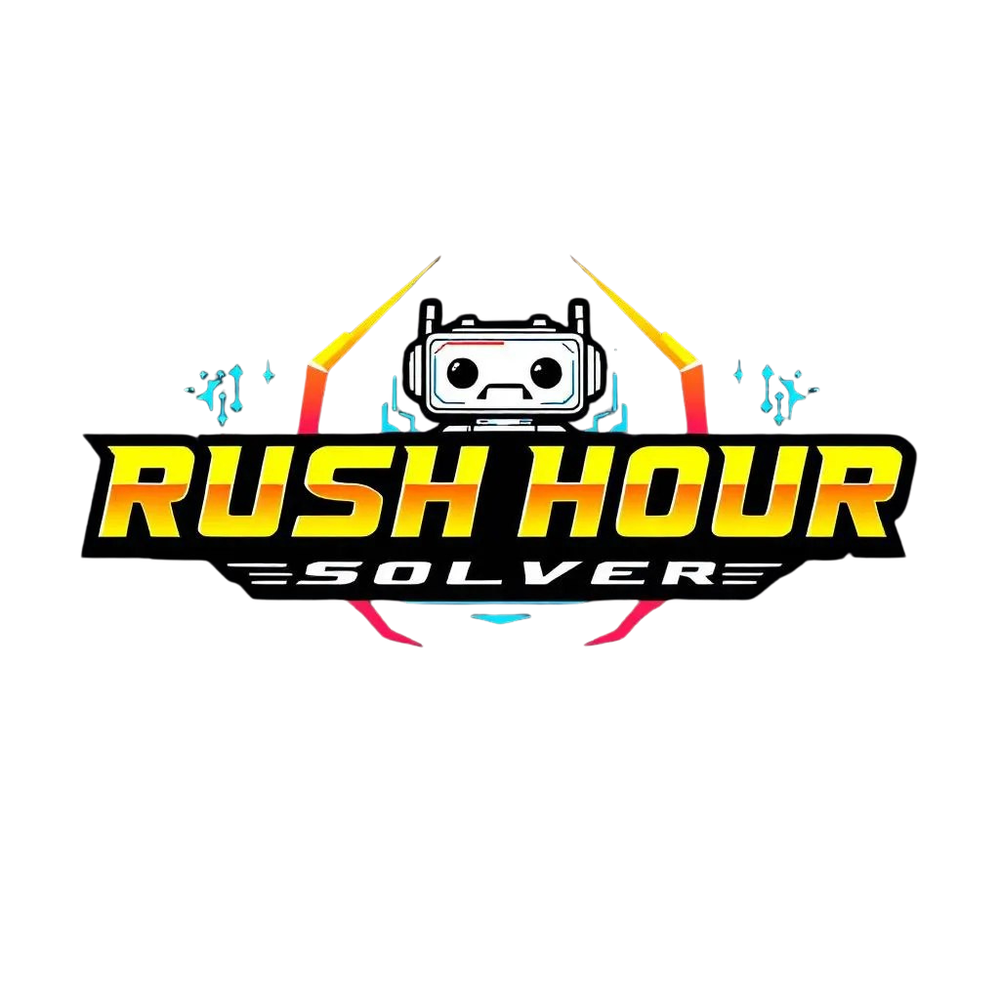
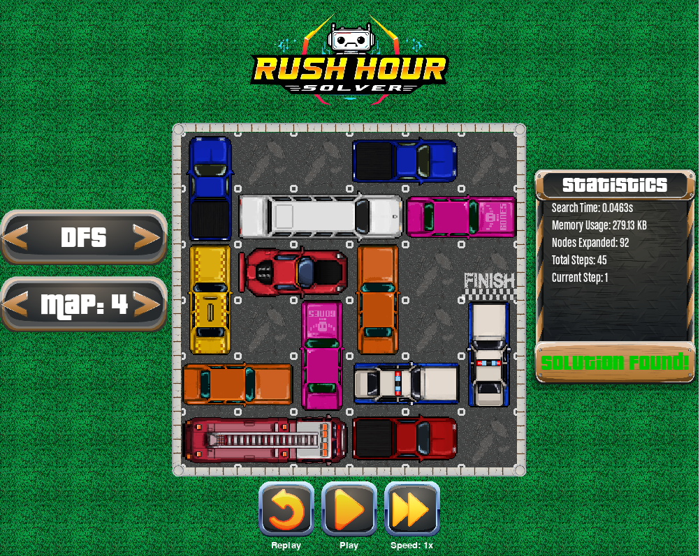

<h1 align=center>
    
</h1>

## Overview

<h3 align=center>
    
</h3>

In this project, our team develop a solver for Rush Hour. 

There are 4 algorithms used in the solver: __BFS, DFS, UCS and A*__. Our team also provided _**10**_ different maps. User can choose maps and algorithms freely.


## Quick start

Clone this repository to your local machine.

```bash
git clone https://github.com/thaisonho/ai-rush-hour.git
```

It is prefered to setup a Python virtual evironment before installing other dependencies. And make sure to have Python3 installed on your machine.

```bash
cd ai-rush-hour/
python3 -m venv .venv
source .venv/bin/activate # On Linux
. .venv/Scripts/activate # On Windows
pip install -r requirements.txt
```

Run the GUI.

``` bash
python3 src/gui.py
```

## Keymaps

Along with the interactive GUI, we also provide keymaps to interact with the program

|Key|Action|
|---|---|
|Left Arrow|Choose previous algorithm|
|Right Arrow|Choose next algorithm|
|Shift Left Arrow|Choose previous map|
|Shift Right Arrow|Choose next map|
|Space|Begin Solving/Play/Pause animation|
|R Key|Replay animation|
|S Key|Change the speed of the animation|
|ESC Key|Reset the current map|

